# 🚀 Scalable API Testing Framework – Rest Assured (Java)

### ✍️ Author: Pramod Dutta

A robust **Scalable API Testing Framework** built using **Rest Assured** for testing the CRUD operations of the **Restful Booker API**. This framework follows a **hybrid design pattern**, integrates CI/CD pipelines, and generates rich **Allure Reports**.

---

## 📌 Table of Contents

* [Overview](#-overview)
* [Tech Stack](#-tech-stack)
* [Architecture](#-architecture)
* [Framework Flow](#-framework-flow)
* [Project Structure](#-project-structure)
* [Setup & Execution](#-setup--execution)
* [E2E Integration Test Flows](#-e2e-integration-test-flows)
* [Retry Analyzer & Listeners](#-retry-analyzer--listeners)
* [Log4j Logging](#-log4j-logging)
* [MySQL DB Integration](#-mysql-db-integration)
* [Parallel Execution](#-parallel-execution)
* [Allure Reporting](#-allure-reporting)
* [CI/CD Integration](#-cicd-integration)
* [JSON Schema Validation](#-json-schema-validation)
* [Best Practices](#-best-practices)

---

## 📖 Overview

This framework is designed to:

* Automate **CRUD operations** of REST APIs
* Provide **scalable and maintainable test architecture**
* Support **parallel execution**
* Integrate with **CI/CD pipelines**
* Generate **detailed reports with Allure**
* Validate API responses against **MySQL Database**
* Provide comprehensive **Log4j logging**

---

## 🛠 Tech Stack

| Category | Technology |
|----------|------------|
| Language | Java (JDK 23+) |
| API Testing | Rest Assured 6.0.0, JSON Schema Validator 5.4.0 |
| Test Framework | TestNG 7.12.0 |
| Build Tool | Maven |
| Assertions | AssertJ 3.27.7 |
| JSON Parsing | GSON 2.13.2 |
| Logging | Log4j2 2.23.1 |
| Reporting | Allure TestNG 2.33.0 |
| Test Data | Apache POI 5.3.0, JavaFaker 1.0.2 |
| Database | MySQL Connector/J 9.3.0 |
| Config | dotenv-java 3.0.0, SnakeYAML 2.2 |
| CI/CD | Jenkins |
| Dashboard | React + Vite + Recharts, Express + SQLite (see `dashboard/`) |

---

## 🏗 Architecture

The framework follows a **Hybrid Framework Design** combining:

* API abstraction layer
* Data-driven testing with POJOs
* Utility-based reusable components
* Log4j logging throughout

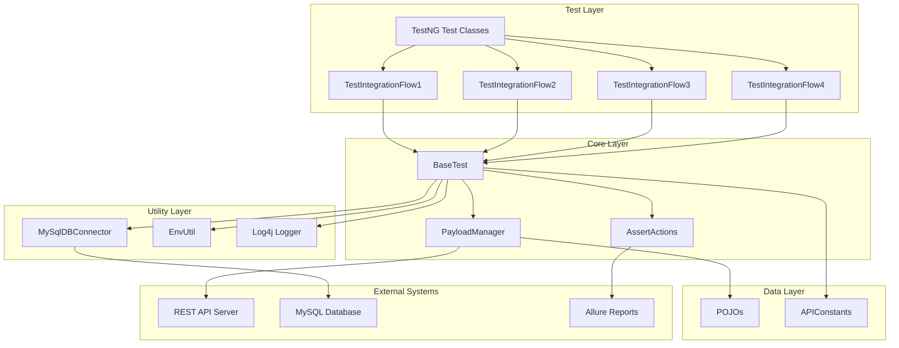

---

## 🔄 Framework Flow

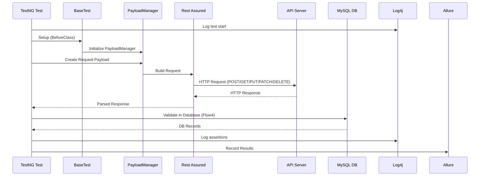

---

## 📁 Project Structure

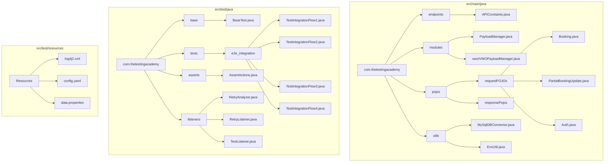

---

## ⚙️ Setup & Execution

### 🔹 Prerequisites

* Install Java (JDK 23+)
* Install Maven
* (Optional) Install MySQL for DB validation tests

### 🔹 Environment Setup

1. Copy the sample environment file:
```bash
cp .env.sample .env
```

2. Edit `.env` and fill in your credentials:
```env
# API Credentials
USERNAME=your_username
PASSWORD=your_password

# MySQL (for Flow4)
MYSQL_HOST=localhost
MYSQL_PORT=3306
MYSQL_DATABASE=api_automation
MYSQL_USERNAME=your_db_username
MYSQL_PASSWORD=your_db_password
```

**Important:** The `.env` file is in `.gitignore` and will NOT be committed to version control.

### 🔹 Run Commands

```bash
# Run all tests with default suite
mvn test

# Run E2E integration tests
mvn test -Dsurefire.suiteXmlFiles=testng-e2e.xml

# Run sample tests
mvn test -Dsurefire.suiteXmlFiles=testng-sample.xml

# Run a specific test class
mvn test -Dtest=com.thetestingacademy.tests.e2e_integration.TestIntegrationFlow1

# Compile without running tests
mvn clean compile
```

---

## 🔗 E2E Integration Test Flows

The framework includes **4 comprehensive E2E integration test flows**:

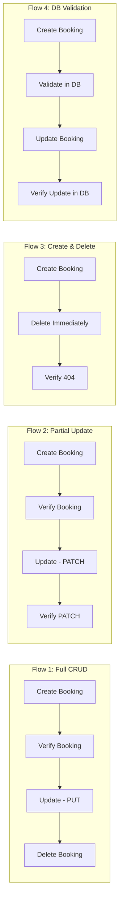

### Test Flow Details

| Flow | Class | Steps | Description |
|------|-------|-------|-------------|
| **Flow 1** | `TestIntegrationFlow1` | 4 | Create → Verify → PUT Update → Delete |
| **Flow 2** | `TestIntegrationFlow2` | 4 | Create → Verify → PATCH (firstname/lastname only) → Verify PATCH |
| **Flow 3** | `TestIntegrationFlow3` | 3 | Create → Delete → Verify Deleted (404) |
| **Flow 4** | `TestIntegrationFlow4` | 4 | Create → Validate in MySQL → Update → Verify Update in MySQL |
| **Flow 5** | `TestIntegrationFlow5_DDT` | DDT | Data-Driven: Create bookings from Excel data |

### Data-Driven Testing (DDT) - Flow 5

Flow 5 uses **TestNG DataProvider** with **Apache POI** to read test data from Excel:

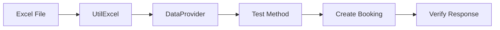

**Excel Structure Required** (`src/test/resources/TestData.xlsx` - Sheet: "Booking"):

| firstname | lastname | totalprice | depositpaid | checkin | checkout | additionalneeds |
|-----------|----------|------------|-------------|---------|----------|-----------------|
| John | Doe | 150 | true | 2024-01-01 | 2024-01-05 | Breakfast |
| Jane | Smith | 200 | false | 2024-02-10 | 2024-02-15 | Lunch |

### TestNG Suite Configuration

```xml
<!-- testng-e2e.xml -->
<suite name="E2E Integration Test Suite" verbose="2">
    <listeners>
        <listener class-name="com.thetestingacademy.listeners.RetryListener"/>
        <listener class-name="com.thetestingacademy.listeners.TestListener"/>
    </listeners>
    <test name="E2E Integration Tests" preserve-order="true">
        <classes>
            <class name="com.thetestingacademy.tests.e2e_integration.TestIntegrationFlow1"/>
            <class name="com.thetestingacademy.tests.e2e_integration.TestIntegrationFlow2"/>
            <class name="com.thetestingacademy.tests.e2e_integration.TestIntegrationFlow3"/>
            <class name="com.thetestingacademy.tests.e2e_integration.TestIntegrationFlow4"/>
        </classes>
    </test>
    <test name="Data-Driven Tests" preserve-order="true">
        <classes>
            <class name="com.thetestingacademy.tests.e2e_integration.TestIntegrationFlow5_DDT"/>
        </classes>
    </test>
</suite>
```

---

## 🔄 Retry Analyzer & Listeners

The framework includes **automatic retry** for failed tests and **comprehensive test listeners** for logging and reporting.

### Retry Mechanism Flow

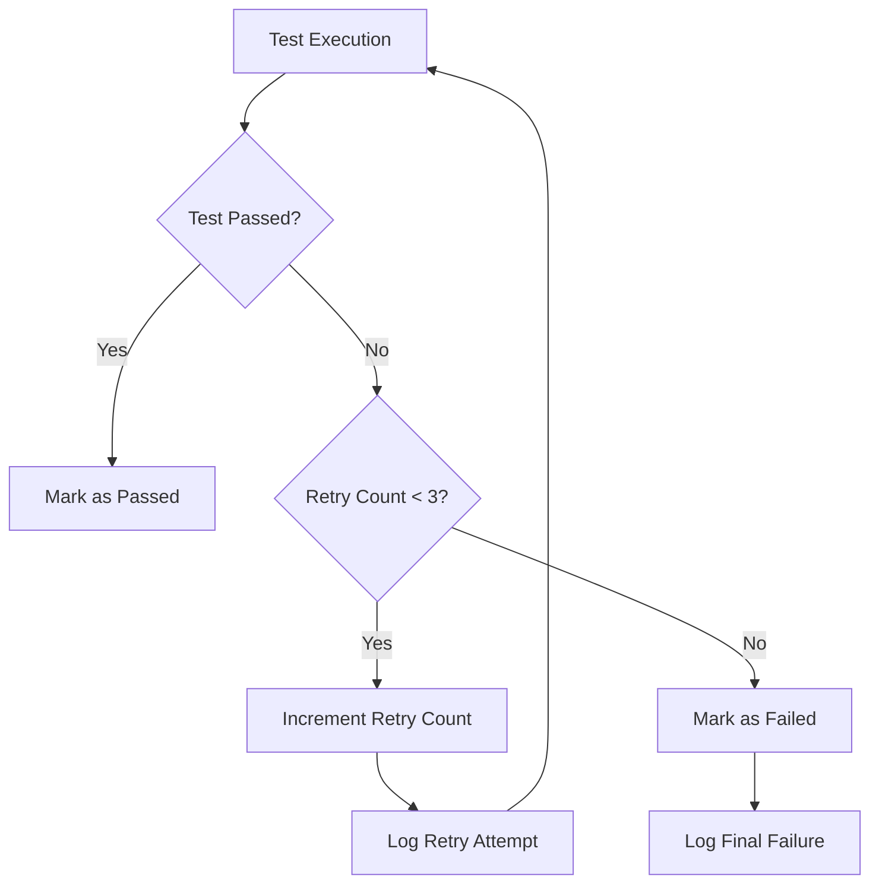

### Listeners

| Listener | Class | Description |
|----------|-------|-------------|
| **RetryListener** | `IAnnotationTransformer` | Automatically applies RetryAnalyzer to all test methods |
| **RetryAnalyzer** | `IRetryAnalyzer` | Retries failed tests up to 3 times |
| **TestListener** | `ITestListener` | Logs test start, pass, fail, skip events |

### RetryAnalyzer Implementation

```java
public class RetryAnalyzer implements IRetryAnalyzer {
    private static final int MAX_RETRY_COUNT = 3;
    private int retryCount = 0;

    @Override
    public boolean retry(ITestResult result) {
        if (retryCount < MAX_RETRY_COUNT) {
            retryCount++;
            logger.warn("Retrying test '{}' - Attempt {} of {}",
                    result.getName(), retryCount, MAX_RETRY_COUNT);
            return true;
        }
        return false;
    }
}
```

### TestListener Events

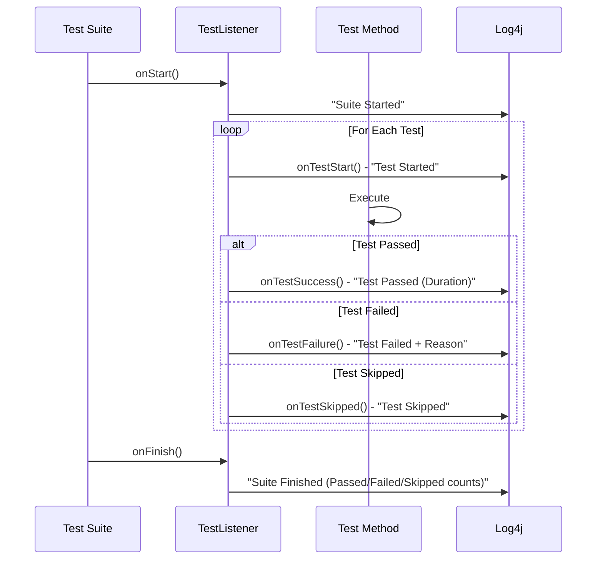

---

## 🪵 Log4j Logging

The framework uses **Log4j2** for comprehensive logging throughout test execution.

### Log Configuration

Located at `src/test/resources/log4j2.xml`:

```xml
<?xml version="1.0" encoding="UTF-8"?>
<Configuration status="WARN">
    <Appenders>
        <Console name="Console" target="SYSTEM_OUT">
            <PatternLayout pattern="%d{yyyy-MM-dd HH:mm:ss} %-5p %c{1} - %m%n"/>
        </Console>
        <File name="FileLogger" fileName="logs/test.log">
            <PatternLayout pattern="%d{yyyy-MM-dd HH:mm:ss} %-5p %c{1} - %m%n"/>
        </File>
    </Appenders>
    <Loggers>
        <Root level="info">
            <AppenderRef ref="Console"/>
            <AppenderRef ref="FileLogger"/>
        </Root>
    </Loggers>
</Configuration>
```

### Logging Flow

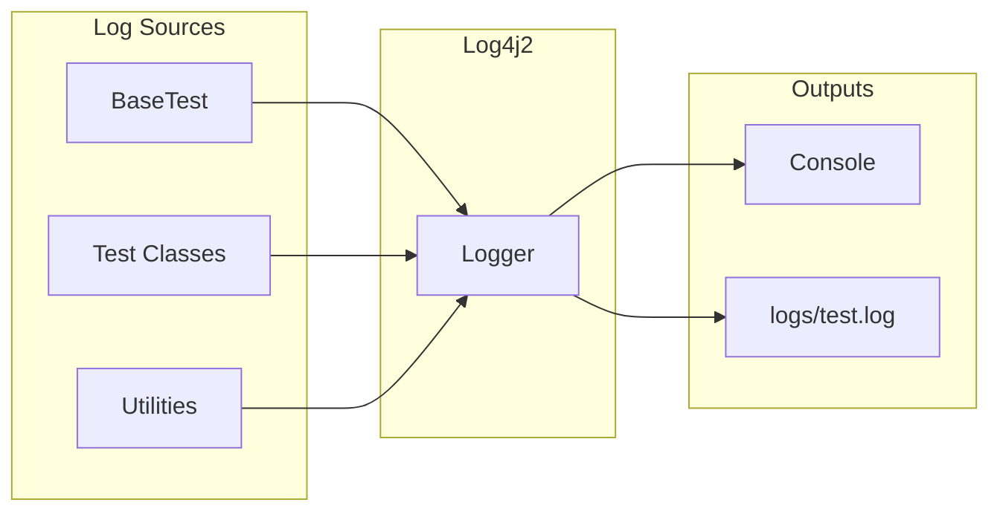

### Usage in Tests

```java
// In BaseTest (inherited by all test classes)
protected static final Logger logger = LogManager.getLogger(BaseTest.class);

// Example logging
logger.info("=== TC#INT1 - Step 1: Creating Booking ===");
logger.info("Booking created successfully with ID: {}", bookingid);
logger.debug("Auth payload: {}", payload);
logger.error("Database validation failed: {}", e.getMessage());
```

---

## 🗄 MySQL DB Integration

Use this when you want to validate API data against MySQL or seed/clean test data before a test run.

### DB Validation Flow

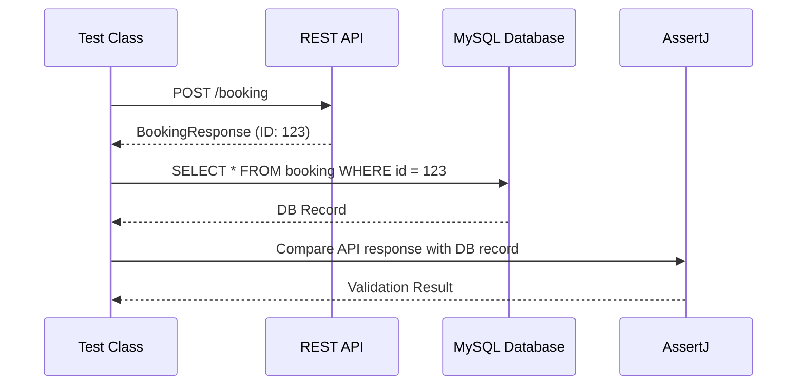

### Configure Environment Variables

Add the DB values to your local `.env` file:

```env
MYSQL_HOST=localhost
MYSQL_PORT=3306
MYSQL_DATABASE=api_automation
MYSQL_USERNAME=api_user
MYSQL_PASSWORD=StrongPassword123
MYSQL_JDBC_PARAMS=useSSL=false&allowPublicKeyRetrieval=true&serverTimezone=UTC
```

### Example: TestIntegrationFlow4

```java
@Test(groups = "qa", priority = 2)
@Description("TC#INT4 - Validate Booking exists in MySQL Database")
public void testValidateBookingInDatabase(ITestContext iTestContext) {
    Integer bookingid = (Integer) iTestContext.getAttribute("bookingid");

    try (Connection connection = MySqlDBConnector.getConnection()) {
        List<Map<String, Object>> rows = MySqlDBConnector.executeSelect(
            connection,
            "SELECT booking_id, firstname, lastname FROM booking WHERE booking_id = ?",
            bookingid
        );

        assertThat(rows).isNotEmpty();
        assertThat(rows.get(0).get("firstname")).isEqualTo(expectedFirstname);
    }
}
```

---

## ⚡ Parallel Execution

Run tests in parallel using TestNG:

```xml
<suite name="All Test Suite" parallel="classes" thread-count="3">
```

### Execution Flow

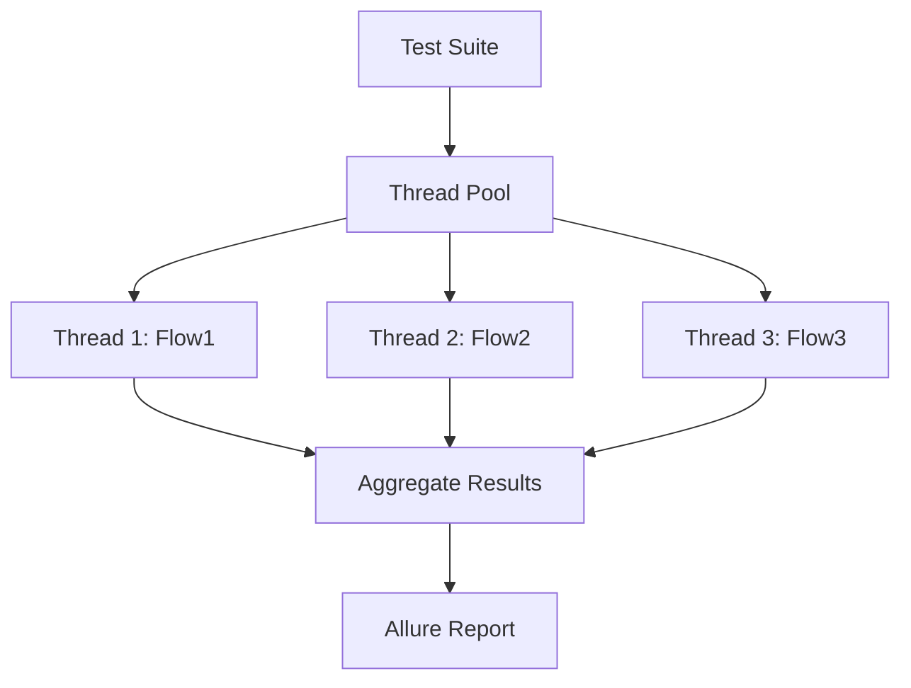

---

## 📊 Allure Reporting

### Install Allure

```bash
brew install allure
```

### Generate Report

```bash
mvn clean test
allure generate allure-results --clean -o allure-report
allure open allure-report
```

### Reporting Flow

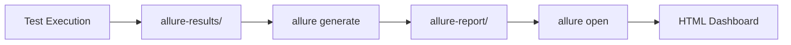

### Allure Annotations Used

```java
@Owner("Promode")
@Description("TC#INT1 - Step 1. Verify that the Booking can be Created")
@Test(groups = "qa", priority = 1)
public void testCreateBooking(ITestContext iTestContext) {
    // test implementation
}
```

---

## 🔁 CI/CD Integration

This framework supports Jenkins pipeline execution.

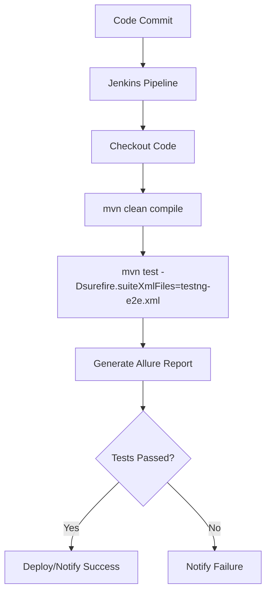

---

## 🔍 JSON Schema Validation

The framework includes **JSON Schema validation** to automatically validate API response structures against predefined schemas.

### Schema Files

Located in `src/test/resources/schemas/`:

| Schema File | Description |
|-------------|-------------|
| `booking-schema.json` | Validates GET booking response |
| `booking-response-schema.json` | Validates POST booking creation response |
| `token-response-schema.json` | Validates authentication token response |
| `error-response-schema.json` | Validates error responses |

### Validation Flow

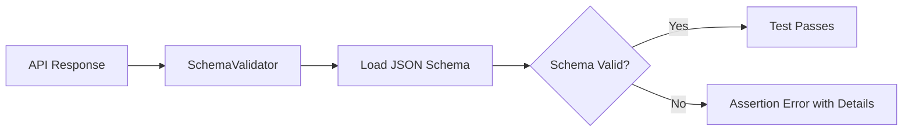

### Usage Examples

```java
// Using convenience methods in AssertActions
assertActions.verifyBookingResponseSchema(response);
assertActions.verifyTokenResponseSchema(response);
assertActions.verifyBookingSchema(response);

// Using generic method with custom schema file
assertActions.verifyResponseSchema(response, "booking-schema.json");

// Check validity without throwing exception
boolean isValid = SchemaValidator.isValidSchema(response, SchemaValidator.Schemas.BOOKING_RESPONSE);
```

### Schema Validation Test Class

Run schema validation tests:

```bash
mvn test -Dtest=TestSchemaValidation
```

**Tests included:**
- `testBookingResponseSchema()` - Validates booking creation response
- `testTokenResponseSchema()` - Validates token response
- `testBookingSchema()` - Validates GET booking response
- `testInvalidSchemaFails()` - Verifies invalid schema detection
- `testGenericSchemaValidation()` - Tests generic validation method

---

## 🧠 Best Practices

* Use **POJOs for request/response modeling** - `Booking`, `PartialBookingUpdate`, `Auth`
* Keep **test data separate** with PayloadManager
* Use **centralized configuration** via `APIConstants` and `EnvUtil`
* Implement **Log4j logging** for debugging and traceability
* Add **assertion layers** with `AssertActions` and AssertJ
* Use **ITestContext** for sharing state between ordered test methods
* Maintain **clean folder structure** - POJOs, modules, utils, tests

---

## 📸 Screenshots

### Test Execution


### CI/CD Pipeline


### Allure Report


---

## 📊 Test Results Dashboard

A lightweight React + SQLite dashboard that ingests Surefire output and visualises pass/fail counts, per-run drilldowns, daily trends, and top failing tests behind a login. Full instructions: [`dashboard/README.md`](dashboard/README.md).

```bash
# One-time install
cd dashboard/backend  && npm install
cd dashboard/frontend && npm install
cd dashboard/ingest   && npm install

# Run it
cd dashboard/backend  && npm start     # http://localhost:4000
cd dashboard/frontend && npm run dev   # http://localhost:5180 (admin / admin123)

# Feed a new run into the DB after any mvn test
node dashboard/ingest/ingest.js
```

The ingest script parses `target/surefire-reports/testng-results.xml` and writes a new run record (plus per-test rows) into `dashboard/backend/data/dashboard.sqlite`. The dashboard auto-refreshes every 15 seconds.

---

## 🤖 Groq Chat Completions Module

A second API project mirroring the VWO pattern covers Groq's OpenAI-compatible `chat.completions` endpoint:

| Location | Purpose |
|---|---|
| `endpoints/APIConstants.java` | `GROQ_BASE_URL`, `GROQ_CHAT_COMPLETIONS_URL`, `GROQ_DEFAULT_MODEL` |
| `pojos/groq/requestPOJO/` | `ChatCompletionRequest`, `Message` |
| `pojos/groq/responsePojo/` | `ChatCompletionResponse`, `Choice`, `ChatMessage`, `Usage`, `GroqErrorResponse` |
| `modules/groq/GroqPayloadManager.java` | Gson ser/deser for request/response/error |
| `tests/individual/groq/TestGroqChatCompletion.java` | Positive + invalid-key negative tests |

Set `GROQ_API_KEY` in `.env` (see `.env.sample`), then:

```bash
mvn test -Dtest=TestGroqChatCompletion
```

The key is read via `EnvUtil.getGroqApiKey()` and is never hardcoded.

---

## 🎯 Conclusion

This framework provides a **scalable, maintainable, and production-ready solution** for API automation with:

* Clean architecture with separation of concerns
* 5 comprehensive E2E integration test flows (including DDT)
* JSON Schema validation for API response structure verification
* Log4j2 logging for debugging and traceability
* MySQL database validation support
* Powerful Allure reporting
* CI/CD readiness with Jenkins
* Extensibility for future enhancements
